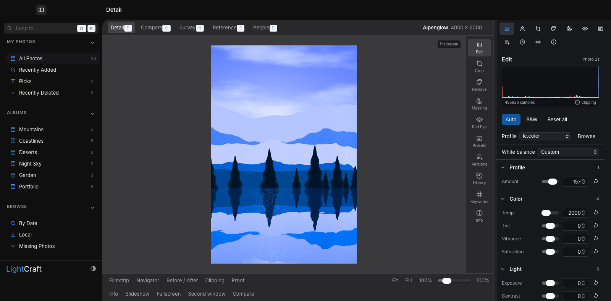
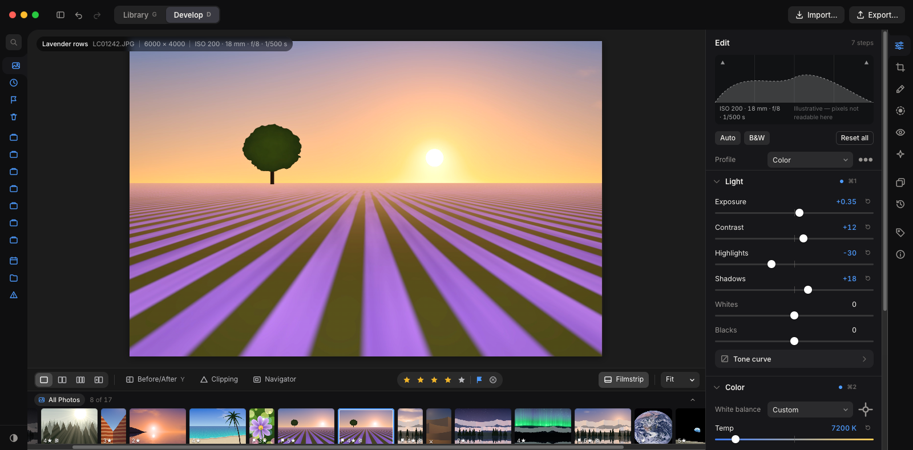
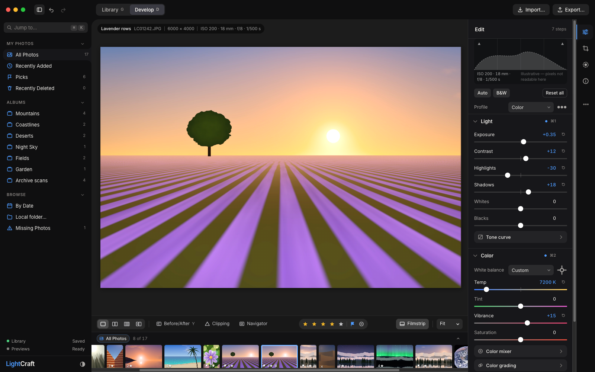

# LightCraft design review

[Open phone-friendly gallery](https://orthic-labs.github.io/lightcraft/)

Both sidebars stay open in Astra revision. Review Import → Crop/Masking → Export first, then Presets/History.

Current captures show native LightCraft. Fable & Astra mockups simulate presentation & interaction. Actual processing stays in Rust.

## Develop

### Current

### Fable 5.1

### Astra

[Assets & licensing](assets/ATTRIBUTION.md)

[Fable’s opinion after reviewing Astra](fable/followup-opinion.md)
