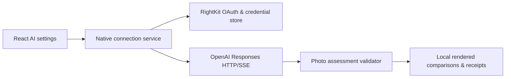

# Ember: ChatGPT plan integration spec

Status: proposed implementation; researched 9 October 2026. No provider connection or paid inference performed for this spec.

## Decision & scope

Add **Continue with ChatGPT** to Ember's native macOS/Windows AI settings. Eligible users connect their own Plus/Pro account & authorize photo assessment against existing plan usage. Use public Responses API directly; keep credentials & network requests in Rust. Preserve local deterministic Auto, local culling & existing OpenRouter experiment.

OpenAI's local OSS route uses dynamic registration during authorization, without partner API key or client secret. No advance application is specified for this route. Paid/remotely hosted products have a separate interest process. Eligibility remains enforced per user/workspace by OpenAI. See [OSS overview](https://developers.openai.com/siwc/token-sharing-open-source) & [quickstart](https://developers.openai.com/siwc/quickstart).

V1 connects accounts, lists usable models & runs existing read-only photo assessments with comparison receipts. Catalog mutation, automated rejection/deletion, cloud masking & generative pixel replacement stay outside V1. Cloud culling needs its own comparison schema & evaluation; current assessment schema describes eight tone/color controls, not culling decisions.

## Google option

For direct Gemini V1, users create an AI Studio key & enter it once into native secure storage. AI Studio can create project/key pairs for new users. Selected models offer free usage within quotas; quota belongs to project/account, not each Google identity. A bundled shared key would expose credentials & pool everyone's allowance.

Google also supports desktop OAuth, but requires Cloud project/API setup & project authorization. Identity-only Google login supplies no Gemini quota. OAuth could remove key copying later while retaining project selection/permission work; ordinary users using an Ember-funded backend would consume Ember's shared quota/billing. Start with user-owned keys. See [key setup](https://ai.google.dev/gemini-api/docs/api-key), [OAuth](https://ai.google.dev/gemini-api/docs/oauth) & [billing](https://ai.google.dev/gemini-api/docs/billing).

Google's free-tier data terms differ from existing strict OpenRouter routing: explain provider data use before upload & require an explicit provider privacy choice. Do not equate free Gemini with zero retention. New Cloud $300 Welcome credits cannot fund Gemini Developer API/AI Studio usage. See [pricing](https://ai.google.dev/gemini-api/docs/pricing) & [billing eligibility](https://ai.google.dev/gemini-api/docs/billing#can-i-use-my-google-cloud-welcome-credit-with-the-gemini-api).

## Current code & boundaries

`crates/photo-ai` owns proxy constraints, assessment schema & validation. Its existing transport uses OpenRouter Chat Completions, non-streaming responses & API-key billing. `apps/lightcraft-cli/src/photo_ai.rs` owns experiment orchestration, renders & receipts. `crates/engine/src/cmd/photo_ai.rs` exposes models/schema/validation. None currently implements ChatGPT OAuth or subscription usage.

React receives redacted account status, models, progress & validated assessments. It never receives bearer/refresh/ID tokens. Engine remains sole authority for originals, render settings & later edit application. Local proxies contain no source paths, GPS or embedded metadata.

Shared ownership: `rightkit-oauth` for authorization, `rightkit-secrets` for credentials, `rightkit-http` for transport & `rightkit-jobs` for job lifecycle. Registry-recorded availability is not proof of integration. First implementation task audits published APIs & dependency graphs against Ember's pure-Rust policy. Verify dynamic client IDs, arbitrary resource/scope parameters, callback decoding, OIDC/JWKS validation, atomic rotating credentials & bounded cancellable SSE. Extend shared owners where needed; retain current fetch transport until HTTP owner qualifies. Do not add Node/Electron/Codex CLI runtime solely for this flow.

## Authorization contract

Follow [canonical registration flow](https://developers.openai.com/siwc/token-sharing-open-source/sign-in):

1. Persist installation-specific opaque host UUID. Start loopback listener before browser opens; use `127.0.0.1` & stable callback path. Generate fresh state, nonce & PKCE S256 per attempt.
2. Initial authorization uses `client_id=dynamic_agent_client`, Ember as name hint, host identifier & scopes below. Save issued client ID from successful callback; placeholder is never used for code exchange.
3. Validate callback state. Exchange code with issued client ID, PKCE verifier, exact callback URI & resource, without secret.
4. Verify ID-token signature via OpenAI discovery/JWKS; check issuer, audience, expiration & nonce. Enable inference only when granted scopes include plan permission.
5. Reauthorization reuses issued client ID & same host ID. Preserve selected registration until replacement identity validates.

| Value | Contract |
|---|---|
| Authorization | `https://auth.openai.com/api/accounts/authorize` |
| Token exchange | `https://auth.openai.com/api/accounts/oauth/token` |
| Resource | `https://api.openai.com/v1` |
| Identity scopes | `openid profile email` |
| Plan scopes | `offline_access resource.invoke chatgpt.tokens.use.direct` |
| Callback | `http://127.0.0.1:<available-port>/auth/callback` |

Ember-specific safeguards: listener binds loopback only, validates exact path, caps request bytes, rejects duplicate security fields & replay, expires pending transactions after five minutes, closes on cancel/completion & redacts authorization URLs. State/nonce/verifier stay native & ephemeral. Discovery/JWKS fetches use fixed trusted issuer, bounded cache & maintained signature verification; decoding JWT payload alone never authenticates identity.

## Credentials, switching & disconnect

Keep separate registrations keyed by verified issuer/subject plus issued client ID; email is display information. Native secure storage holds token set, scopes & expiry atomically. Nonsecret settings hold host ID & registration labels. No plaintext fallback when secure store is unavailable.

Access tokens currently last one hour; rotating refresh tokens last 30 days. Serialize refreshes across processes per registration & atomically replace token set. Temporary network failures preserve connection. Terminal refresh errors clear unusable tokens & enable reauthorization. Account switch pauses outstanding jobs & invalidates their delivery generation, preventing old-account results crossing into new jobs. Disconnect cancels requests, attempts discovered revocation endpoint & removes local tokens; show remote revocation status honestly. See [sessions](https://developers.openai.com/siwc/token-sharing-open-source/profiles-and-sessions) & [token reference](https://developers.openai.com/siwc/token-sharing-open-source/token-reference).

## Models & inference

Fetch `GET https://api.openai.com/v1/models` using selected account's OAuth token; display listed models in server order, use returned slug & refresh on account switch. Intersect catalog with verified image/structured-output support. Never assume API catalog equals subscription eligibility or silently substitute unavailable models. See [account model discovery](https://developers.openai.com/siwc/token-sharing-open-source/models-and-inference).

Proposed defaults, subject to photo evaluation:

| Task | Model/effort | Purpose |
|---|---|---|
| Existing tone assessment | GPT-6.1 Sol / low | Balanced starting point |
| Future bounded culling comparison | GPT-6 Luna / low | Test economical routine ranking |
| Difficult comparisons / quality benchmark | GPT-6 Astra / medium | Explicit higher-usage option |

Use Standard speed; no automatic escalation. These roles are design choices based on [current family guidance](https://developers.openai.com/api/docs/guides/latest-model), not measured photo-quality claims. Pick another available model explicitly if preferred model lacks account access.

POST `https://api.openai.com/v1/responses` with native bearer credential, input-message array, metadata-free inline image, developer instructions & strict assessment JSON schema via `text.format`. Set `store:false` & `stream:true`; consume SSE through `response.completed` before publishing assessment. Validate finite bounded values, schema & refusal/completion state locally. Confirm strict schema works on this subscription route during qualification; unsupported capability disables model for assessment. See [inference](https://developers.openai.com/siwc/token-sharing-open-source/models-and-inference) & [structured outputs](https://developers.openai.com/api/docs/guides/structured-outputs).

Route currently rejects `max_output_tokens`, `background`, persistent conversation handles & several other regular API options. Build a separate Responses encoder/parser; do not send OpenRouter body. Disable tools & service-tier overrides. Images are supported for compatible models; image generation & Files upload are unavailable here. See [preview constraints](https://developers.openai.com/siwc/token-sharing-open-source/preview-limitations).

Retain 512px proxy/2MiB image cap initially. Cap outgoing JSON at 4MiB, aggregate stream at 256KiB, individual event at 64KiB, request deadline at 45s, one request in flight & 25 requests per initial experiment. These are proposed local limits. Cancellation closes transport & prevents result publication; stopping stream cannot guarantee stopped billing. No automatic retry after dispatch/interruption: record usage as unknown if terminal usage is missing. A local timeout/byte cap is not a provider token/spend cap.

512px previews cannot establish original-pixel sharpness or blink detail. Local focus/burst measurements remain authoritative; any higher-detail/crop upload requires separately evaluated proxy policy.

## Usage & cost display

Included usage shares existing Codex/ChatGPT work allowance. App cap is a percentage of weekly plan usage: setting Ember to 20% limits its share, without reserving or adding allowance. Plus also shares a five-hour limit across apps; Pro currently has no five-hour limit. Link to provider settings for real limits/resets. See [user controls](https://learn.chatgpt.com/docs/sign-in-with-chatgpt) & [shared windows](https://developers.openai.com/siwc/token-sharing-open-source/profiles-and-sessions#tracking-usage).

Credit illustration only: 2,000 uncached input tokens including images & 1,000 output tokens including reasoning, Standard speed, one call/photo. Published credit rates yield:

| Model | Credits / call | Credits / 100 calls |
|---|---:|---:|
| GPT-6 Luna | 0.0175 | 1.75 |
| GPT-6.1 Sol | 0.35 | 35 |
| GPT-6 Astra | 1.75 | 175 |

Calculation: `(input tokens × input credit rate + output tokens × output credit rate) / 1,000,000`. Rates per million are Luna 2.5/12.5, Sol 50/250, Astra 250/1,250. Token totals, caching & effort change results. Purchased-credit estimates do not translate into included-plan percentages; dollar conversion depends on purchase terms. See [official credit rate card](https://learn.chatgpt.com/docs/pricing#token-rates).

Show provider/model, Using ChatGPT plan, completed calls, token totals & Manage usage linking to `https://chatgpt.com/settings/usage`. Separate estimated credits from provider-reported values. These docs establish no supported per-app live-percentage endpoint; show percentage as unavailable unless later documented. Do not read private ChatGPT backend endpoints or fabricate remaining photo counts.

Recommend provider weekly cap of 20% during evaluation & credits-after-limit off; only user changes provider controls. No automatic paid-provider fallback. See [UI guidance](https://developers.openai.com/siwc/ui-ux-guidelines).

## Failures & receipts

Handle OAuth denial without inference. Usage-limit failure pauses job & opens Manage usage action; it can occur after stream starts. Unsupported capability disables incompatible configuration. Ineligible user stops attempts. Temporary availability failures preserve credentials & pause for later manual resume; do not repeat photo requests automatically. Preserve sanitized status/error code/request ID & distinguish complete, refused, incomplete, cancelled & unknown-usage outcomes. See [error contract](https://developers.openai.com/siwc/token-sharing-open-source/errors-and-recovery).

Extend provider-neutral receipt with billing mode, requested/served model, effort, proxy/prompt/schema hashes, elapsed time, token details, completion state & sanitized error. Persist no tokens, authorization URLs, source paths or unbounded provider body. The current OpenRouter USD-cost requirement stays specific to its transport; ChatGPT receipts use plan/credit accounting explicitly.

## Delivery & acceptance

1. Audit shared owner compatibility; implement any missing reusable OAuth/SSE support in RightKit. Record versions & dependency evidence before adding them to Ember.
2. Add native connection service, redacted bridge commands & Settings UI. Test callback spoof/replay, identity mismatch, account switching, secure-store failure & rotating refresh races.
3. Add separate Responses adapter & receipt accounting. Test split/malformed SSE, interrupted/failed/incomplete terminal states, missing usage, unsupported schema, refusal & unexpected model. Ensure zero catalog/edit mutation.
4. Run deterministic hidden QA on macOS/Windows through generated RightKit Actions; launch only exact qualified artifacts. No broad credential permissions on QA/control/MCP surfaces.
5. Execute configured small live pilot: one eligible account, three consented/procedural images, listed vision model, strict schema, disconnect/reconnect & measured token usage. Then compare held-out shoots with blinded render preference; no quality claim before evidence.

Research/spec validation can run locally. Implementation build, tests & packaging follow repository's generated Actions policy. Ship account connection & read-only assessment first; add measured Google/model comparisons next.
